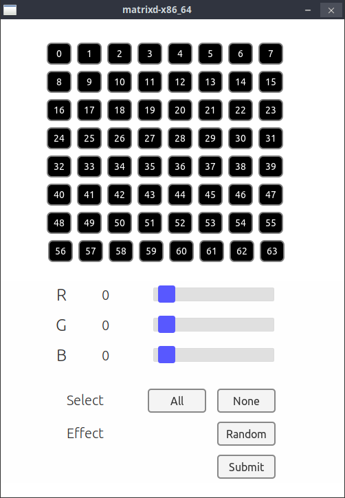

# Matrixd - Matrix Daemon 


A toy project to drive Sense Hat's LED matrix by using Rust and Flutter 

<br/><br/>

## 1. Description

This project consists of 2 parts:
- The UI: a simple web UI based on Flutter/Web that can modify the matrix data for 64 LEDs on Sense Hat.
- The service: a Rust based Linux system daemon with WebSocket that accepts parameters from the web UI and controls the LEDs via I2C.

<br/>

### 1.1 Prerequsites

- Some familiarity regarding Raspberry Pi OS and terminal interface.
- Raspberry Pi 4B and Sense Hat
- Boot parameter: RPI4 and Sense Hat have some issues and it blocks the boot process. To avoid the issues, configure as below when Sense Hat is not installed:
     - For Raspbian OS, add **hdmi_force_hotplug=1** to /boot/config.txt
     - For Ubuntu, add **hdmi_force_hotplug=1** to /boot/firmware/config.txt

<br/><br/>

## 2. Preparation and installation

<br/>

### 2.1 I2C interface activation

Enable i2c communication by using raspi-config.

```sh
$ sudo raspi-config
```

<br/>

### 2.2 Package installation

Download and install matrix package:
```sh
$ curl # TBD
$ sudo dpkg -i matrixd-v0.0.1.deb
$ sudo systemctl status matrixd.service
```

<br/>

### 2.3 (Optional) Service configuration 

In case the port 3000 is being used by other services, please open the configuration file and change the port:
```sh
$ sudo vi /etc/systemd/matrixd.conf
$ sudo systemctl restart matrixd.service
```

<br/><br/>

## 3. How to config and run

Access to the RPI's IP and port 3000 (192.168.0.10:3000 for example) via web browser.  

The UI can be shown on the screen like the below image and the components have features like this:
- Each box represents each LED on Sense Hat (each box can be pressed to be chosen).
- The sliders can change the color of boxes selected.
- All and None buttons can be used to pick all or none of the boxes.
- The red button can be used to send the configuration to the backend. 

<br/>



<br/><br/>

## 4. Clean up

If need to disable or remove the service:
```
$ sudo systemctl disable matrixd.service
$ sudo apt remove matrixd
```

<br/><br/>

## 5. Conclusion

With this simple project, the LEDs on Sense Hat can be easily controlled by the web UI but no SDK installation required. However, anyone interests of using Flutter, Rust, or the I2C of RPI may check the source code in this repository to add more features. 

<br/><br/>

----
**Disclaimer**  
  
```
This is just a toy project that cannot be used for safety/commercial tasks.   
The developer doesn't take any kind of (phsical, mental, and financial) responsibility. 
```
