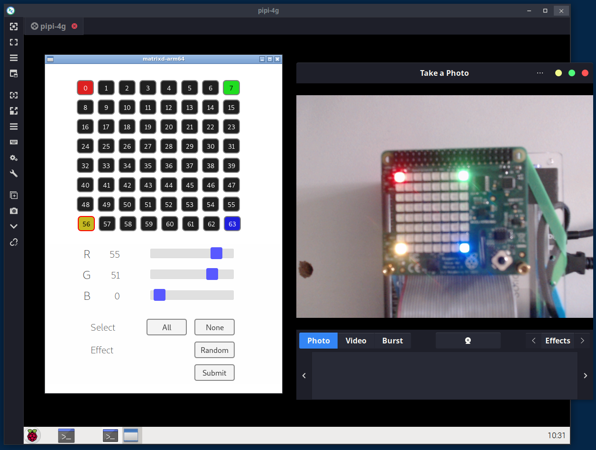

# Matrixd


A toy project to drive Sense Hat's LED matrix by using Go and Svelte. 

<br/><br/>

## 1. Description

This project consists of 2 parts:
- UI: based on Svelte to modify the matrix data for 64 LEDs on Sense Hat.
- Service: based on Go with REST/WebSocket/WebView that accepts parameters from the UI and controls the hardware.

<br/>

### 1.1 Prerequsites

- Some familiarity regarding Raspberry Pi OS and terminal interface.
- Raspberry Pi 4B and Sense Hat
- Boot parameter: RPI4 and Sense Hat have some issues and it blocks the boot process. To avoid the issues, configure as below when Sense Hat is not installed:
     - For Raspberry Pi OS, add **hdmi_force_hotplug=1** to /boot/config.txt
     - For Ubuntu, add **hdmi_force_hotplug=1** to /boot/firmware/config.txt
- Go and Svelte SDK installed in Pi

<br/><br/>

## 2. Preparation and installation

<br/>

### 2.1 i2c activation

Enable i2c communication by using raspi-config.

```sh
$ sudo raspi-config
# Interface options => I2C => Enable

# To confirm:
# The entry 0x46 should have some value, which indicate existence of AATINY MCU
# https://pinout.xyz/pinout/sense_hat
$ sudo apt install i2c-tools
$ sudo i2cdetect -y 1 
```

<br/>

### 2.2 Build

Clone and build:
```sh
$ sudo apt install -y \
    libwebkit2gtk-4.0-dev webkit2gtk-driver
$ git clone https://github.com/bus710/matrixd.git

# For UI
$ cd matrixd/src/ui
$ npm install
$ npm run build

# For service
$ cd ../matrixd
$ make build-arm # or make build-arm64
$ cd bin
$ ./matrixd-arm # or ./matrixd-arm64
```

<br/><br/>

## 3. Usage

The UI can be shown on the screen like the below image and the components have features like this:
- Each box represents each LED on Sense Hat (each box can be pressed to be chosen).
- The sliders can change the color of boxes selected.
- All and None buttons can be used to pick all or none of the boxes.
- The red button can be used to send the configuration to the backend. 

<br/>



<br/><br/>

## 4. Conclusion

With this simple project, the LEDs on Sense Hat can be easily controlled by the web UI but no SDK installation required. However, anyone interests of using Go, Svelte, or the i2c of RPI may check the source code in this repository to add more features. 

<br/><br/>

----

**Disclaimer**

```
This is just a toy project that cannot be used for safety/commercial tasks.   
The developer doesn't take any kind of (phsical, mental, and financial) responsibility. 
```
